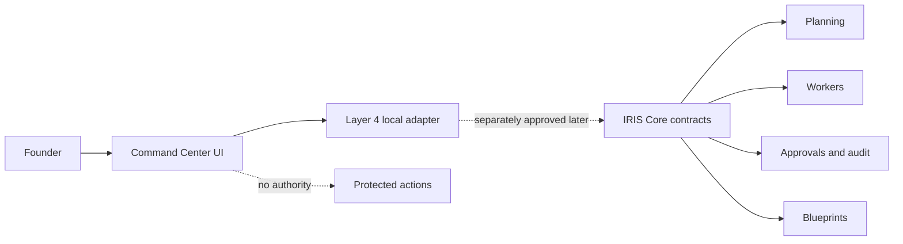

# IRIS Founder Command Center Architecture and Security Proposal

**State:** Pending Founder approval; non-executable

**Bound specification:** `sha256:244748483dc3b7e79157adb828c6db881f561d379987709209ac0ece97c0dd8e`

## Architecture

The Command Center is a separate Layer 4 application. It never owns IRIS identity, policy, approvals, canonical memory, audit meaning, worker authority, blueprint truth, or repository authority.

The first bounded release contains a React interface and a replaceable local application adapter. The interface renders strict view models. The adapter translates allowlisted IRIS Core responses into those view models and rejects undeclared fields. During initial implementation, the adapter uses deterministic synthetic fixtures only. Live IRIS Core connections require a separate approval and contract review.

The application is local-first and binds only to the host loopback interface. It has no public exposure, cloud dependency, telemetry, external account, paid service, GPU requirement, persistent database, or credential in the first release. Canonical state remains in IRIS-owned systems; browser state is presentation-only.

## Exact Proposed Technology

The proposal reuses already reviewed canonical pins and adds no new dependency family:

- Node `24.19.0`
- pnpm `11.20.0`
- TypeScript `6.0.3`
- React `19.2.8`
- React DOM `19.2.8`
- Vite `8.2.0`
- React Vite plugin `6.0.5`
- Zod `4.4.3`
- Vitest `4.1.10`
- ESLint `10.8.0`
- Prettier `3.9.6`

No dependency installation is authorized by this proposal.

## Security Boundaries

- Authentication and Founder identity remain IRIS Core responsibilities. A UI label or local browser session never establishes authority.
- The approval screen displays an exact digest and sends a typed statement only to the existing approval evaluator. It cannot mark itself approved or consume approval locally.
- All mutation controls are disabled until IRIS Core returns an exact actionable state. Unknown, stale, contradictory, unsigned, or unavailable state fails closed.
- Secrets, tokens, environment values, chain-of-thought, unrestricted logs, raw model prompts, and hidden worker context are never rendered.
- Audit and evidence views are read-only, redacted, integrity-checked, and citation-bearing.
- The first release accepts only synthetic data. No canonical repository write, Git action, provider call, deployment, spending, or external resource action exists.
- The development listener is host-only. Public exposure is forbidden by blueprint policy.
- The runtime is non-root, read-only, capability-dropped, no-new-privileges, resource-bounded, and disposable.

## Threat Review

| Threat                                       | Required control                                                                          |
| -------------------------------------------- | ----------------------------------------------------------------------------------------- |
| UI impersonates Founder authority            | Core-authenticated actor context; UI state has zero authority                             |
| Stale proposal is approved                   | Exact proposal digest, revision, expiry, actor, scope, and one-time consumption           |
| Sensitive data leaks through views           | Allowlisted view models, recursive secret filtering, redaction tests                      |
| Browser or dependency executes an action     | No provider credentials or action adapters in release one; strict content security policy |
| Local service becomes publicly reachable     | Loopback binding, host-only blueprint exposure, no public policy                          |
| Audit history is edited                      | Read-only append-only source; integrity verification displayed                            |
| Command Center becomes canonical state owner | Presentation-only local state; IRIS Core remains authoritative                            |

## Rollback and Cleanup

Rejecting this proposal requires deleting only the uncommitted proposal package. A future disposable implementation must stop its exact local process or container, remove its generated workspace and volumes, verify its host port is closed, and confirm zero matching provider resources. No canonical data migration is expected because Layer 4 owns no canonical IRIS state.
